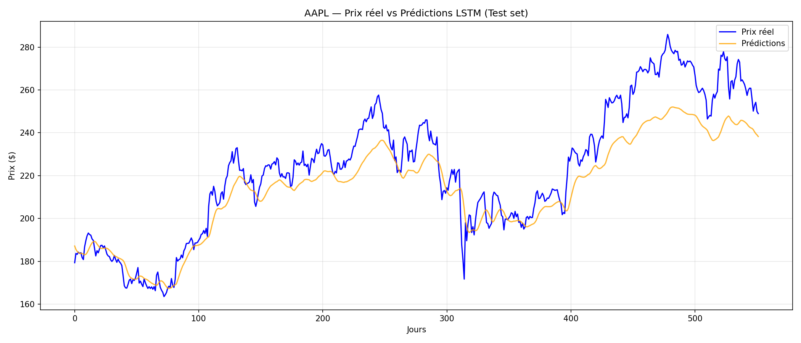
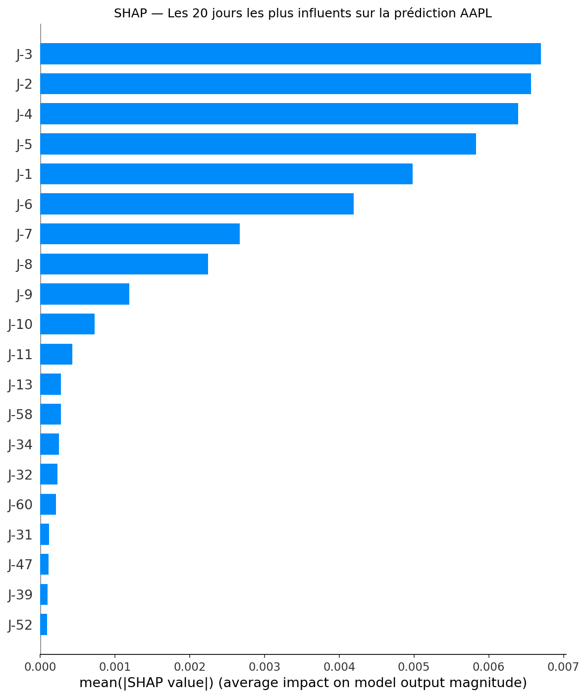
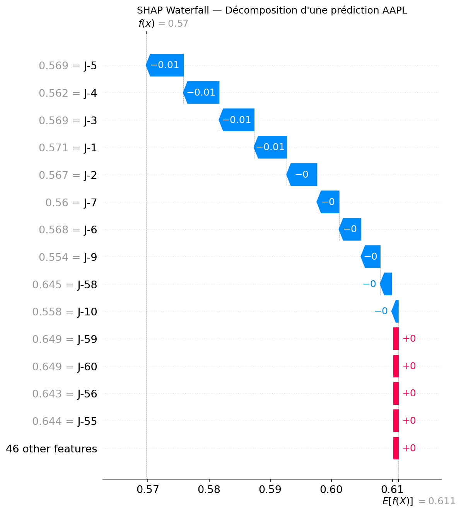
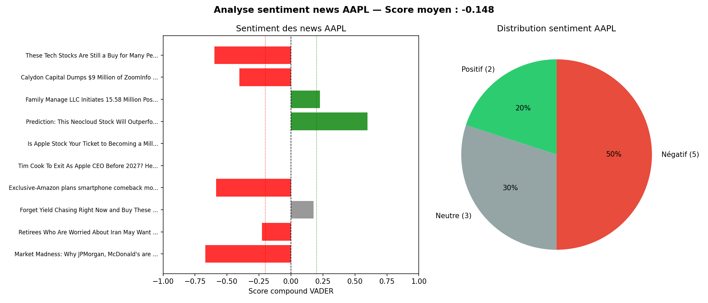

# Stock Market Prediction — LSTM + Sentiment Analysis + XAI

A personal project exploring the intersection of deep learning
and financial markets, inspired by a research thesis from TU Dresden
in collaboration with Orca Capital (Munich).

---

## Motivation

I came across a research thesis combining deep learning and financial
news analysis to predict stock prices. The idea of connecting NLP
and time series forecasting felt like a natural fit for my background
in financial analytics — so I decided to build it myself.

## What it does

- Fetches real AAPL historical data (2015 → 2026) via yfinance
- Trains a 2-layer LSTM with PyTorch to predict next-day closing price
- Analyzes sentiment of recent financial news in real-time using VADER NLP
- Explains each prediction using SHAP values (Explainable AI)

---

## Results

| Metric | Value |
|--------|-------|
| RMSE   | 13.49$ |
| MAE    | 10.61$ |
| MAPE   | 4.46%  |

MAPE below the 5% threshold considered strong for stock price prediction.
SHAP analysis reveals that J-3, J-2 and J-4 are the most influential
features — recent price momentum drives the model significantly more
than price history from 2+ weeks ago.

---

## Visualizations






---

## Project structure
```
├── data_download.py       # historical data collection via yfinance
├── sequences.py           # sliding window sequences + PyTorch Dataset
├── LSTM.py                # model architecture + training loop
├── evaluation.py          # RMSE, MAE, MAPE + actual vs predicted chart
├── VADER_sentiments.py    # real-time news sentiment analysis
├── XAI.py                 # SHAP explainability + waterfall plot
│
├── AAPL_lstm.pth          # saved model weights
├── AAPL_scaler.pkl        # saved MinMaxScaler
├── AAPL_historical.csv    # raw price data
├── AAPL_sentiment.csv     # sentiment scores
│
└── requirements.txt
```

---

## Stack

Python · PyTorch · yfinance · scikit-learn · VADER · SHAP · matplotlib · joblib

---

## Inspired by

[Stock Market Predictions through Deep Learning](https://scads.ai/transfer/theses/stock-market-predictions-through-deep-learning/)
— TU Dresden / ScaDS.AI in collaboration with Orca Capital

---

## What I would improve next
- Replace VADER with FinBERT for deeper financial context understanding
- Build a real-time dashboard with Streamlit
- Extend to a portfolio of multiple tickers
